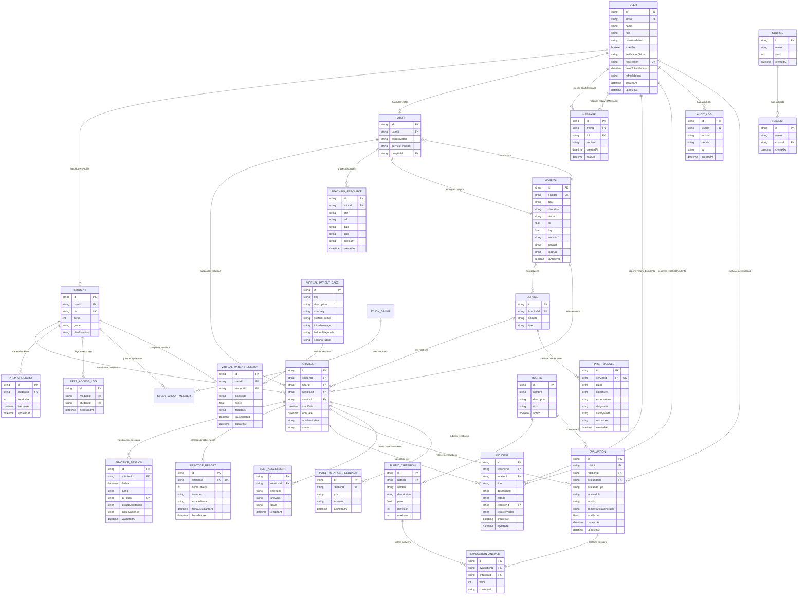

# Mediloop v4.0 Entity-Relationship (ER) Diagram

This document contains a comprehensive database schema relationship diagram for Mediloop v4.0 using Mermaid syntax.

---

```mermaid
erDiagram
    USER ||--o| STUDENT : "has studentProfile"
    USER ||--o| TUTOR : "has tutorProfile"
    USER ||--o{ MESSAGE : "sends sentMessages"
    USER ||--o{ MESSAGE : "receives receivedMessages"
    USER ||--o{ INCIDENT : "reports reportedIncidents"
    USER ||--o{ INCIDENT : "resolves resolvedIncidents"
    USER ||--o{ AUDIT_LOG : "has auditLogs"
    USER ||--o{ EVALUATION : "evaluates evaluations"

    STUDENT ||--o{ ROTATION : "participates rotations"
    STUDENT ||--o{ PREP_CHECKLIST : "tracks checklists"
    STUDENT ||--o{ PREP_ACCESS_LOG : "logs accessLogs"
    STUDENT ||--o{ STUDY_GROUP_MEMBER : "joins studyGroups"

    TUTOR ||--o{ ROTATION : "supervises rotations"
    TUTOR ||--o{ TEACHING_RESOURCE : "shares resources"
    TUTOR ||--o| HOSPITAL : "belongs to hospital"

    HOSPITAL ||--o{ TUTOR : "hosts tutors"
    HOSPITAL ||--o{ SERVICE : "has services"
    HOSPITAL ||--o{ ROTATION : "holds rotations"

    SERVICE ||--o{ ROTATION : "has rotations"
    SERVICE ||--o{ PREP_MODULE : "defines prepModules"

    ROTATION ||--o{ PRACTICE_SESSION : "has practiceSessions"
    ROTATION ||--o| PRACTICE_REPORT : "compiles practiceReport"
    ROTATION ||--o{ INCIDENT : "files incidents"
    ROTATION ||--o{ EVALUATION : "receives evaluations"
    ROTATION ||--o{ SELF_ASSESSMENT : "tracks selfAssessments"
    ROTATION ||--o{ POST_ROTATION_FEEDBACK : "submits feedbacks"

    RUBRIC ||--o{ RUBRIC_CRITERION : "has criteria"
    RUBRIC ||--o{ EVALUATION : "is template for"

    RUBRIC_CRITERION ||--o{ EVALUATION_ANSWER : "scores answers"

    EVALUATION ||--o{ EVALUATION_ANSWER : "contains answers"

    VIRTUAL_PATIENT_CASE ||--o{ VIRTUAL_PATIENT_SESSION : "defines sessions"
    STUDENT ||--o{ VIRTUAL_PATIENT_SESSION : "completes sessions"

    COURSE ||--o{ SUBJECT : "has subjects"

    STUDY_GROUP ||--o{ STUDY_GROUP_MEMBER : "has members"

    USER {
        string id PK
        string email UK
        string name
        string role
        string passwordHash
        boolean isVerified
        string verificationToken
        string resetToken UK
        datetime resetTokenExpires
        string refreshToken
        datetime createdAt
        datetime updatedAt
    }

    STUDENT {
        string id PK
        string userId FK
        string nia UK
        int curso
        string grupo
        string planEstudios
    }

    TUTOR {
        string id PK
        string userId FK
        string especialidad
        string servicioPrincipal
        string hospitalId FK
    }

    HOSPITAL {
        string id PK
        string nombre UK
        string tipo
        string direccion
        string ciudad
        float lat
        float lng
        string website
        string contact
        string logoUrl
        boolean isArchived
    }

    SERVICE {
        string id PK
        string hospitalId FK
        string nombre
        string tipo
    }

    ROTATION {
        string id PK
        string studentId FK
        string tutorId FK
        string hospitalId FK
        string serviceId FK
        datetime startDate
        datetime endDate
        string academicYear
        string status
    }

    PRACTICE_SESSION {
        string id PK
        string rotationId FK
        datetime fecha
        string turno
        string qrToken UK
        string estadoAsistencia
        string observaciones
        datetime validatedAt
    }

    PRACTICE_REPORT {
        string id PK
        string rotationId FK "UK"
        int horasTotales
        string resumen
        string estadoFirma
        datetime firmaEstudianteAt
        datetime firmaTutorAt
    }

    RUBRIC {
        string id PK
        string nombre
        string descripcion
        string tipo
        boolean activo
    }

    RUBRIC_CRITERION {
        string id PK
        string rubricId FK
        string nombre
        string descripcion
        float peso
        int minValor
        int maxValor
    }

    EVALUATION {
        string id PK
        string rubricId FK
        string rotationId FK
        string evaluadorId FK
        string evaluadoTipo
        string evaluadoId
        string estado
        string comentariosGenerales
        float totalScore
        datetime createdAt
        datetime updatedAt
    }

    EVALUATION_ANSWER {
        string id PK
        string evaluationId FK
        string criterionId FK
        int valor
        string comentario
    }

    INCIDENT {
        string id PK
        string reporterId FK
        string rotationId FK
        string tipo
        string descripcion
        string estado
        string resolverId FK
        string resolverNotes
        datetime createdAt
        datetime updatedAt
    }

    MESSAGE {
        string id PK
        string fromId FK
        string toId FK
        string content
        datetime createdAt
        datetime readAt
    }

    TEACHING_RESOURCE {
        string id PK
        string tutorId FK
        string title
        string url
        string type
        string tags
        string specialty
        datetime createdAt
    }

    PREP_MODULE {
        string id PK
        string serviceId FK "UK"
        string guide
        string objectives
        string expectations
        string diagnoses
        string safetyGuide
        string resources
        datetime createdAt
    }

    PREP_ACCESS_LOG {
        string id PK
        string moduleId FK
        string studentId FK
        datetime accessedAt
    }

    PREP_CHECKLIST {
        string id PK
        string studentId FK
        int itemIndex
        boolean isAcquired
        datetime updatedAt
    }

    SELF_ASSESSMENT {
        string id PK
        string rotationId FK
        string timepoint
        string answers
        string goals
        datetime createdAt
    }

    POST_ROTATION_FEEDBACK {
        string id PK
        string rotationId FK
        string type
        string answers
        datetime submittedAt
    }

    VIRTUAL_PATIENT_CASE {
        string id PK
        string title
        string description
        string specialty
        string systemPrompt
        string initialMessage
        string hiddenDiagnosis
        string scoringRubric
    }

    VIRTUAL_PATIENT_SESSION {
        string id PK
        string caseId FK
        string studentId FK
        string transcript
        float score
        string feedback
        boolean isCompleted
        datetime createdAt
    }

    AUDIT_LOG {
        string id PK
        string userId FK
        string action
        string details
        string ip
        datetime createdAt
    }

    COURSE {
        string id PK
        string name
        int year
        datetime createdAt
    }

    SUBJECT {
        string id PK
        string name
        string courseId FK
        datetime createdAt
    }
```
